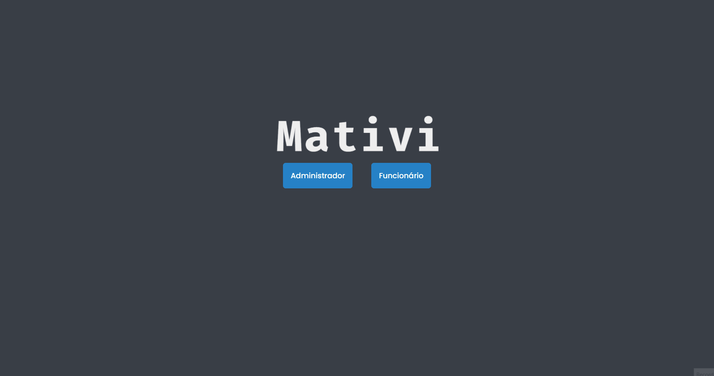

<h1 align="center">MATIVI - Gerenciador de Tarefas</h1>

Aplicação Web criada com ReactJS e Firebase (Firestore e Authentication) para realizar o gerenciamento de tarefas de uma empresa, onde é possível consultar, atualizar, adicionar e excluir tarefas.

## :camera_flash: Demonstração
<h3>Administrador</h3>
</img>

<h3>Funcionário</h3>
</img>

## :rocket: Tecnologias

As seguintes ferramentes foram utilizadas na construção desse projeto:

- ReactJS
- Firebase: Firestore e Authentication

 
    Made by <a href='https://www.linkedin.com/in/matheus-medeiros-da-silva-6172b5216/'>Matheus Medeiros da Silva</a> :man_technologist:
